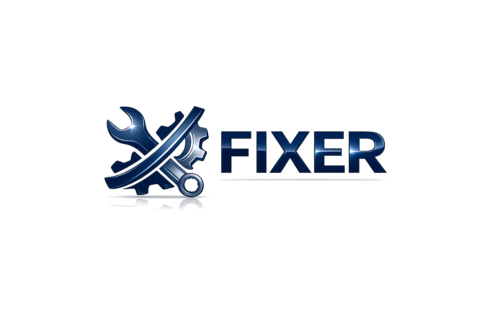

Claro. Abaixo está o **README.md completo em Markdown** para o **FIXER**, seguindo o estilo robusto do modelo que você mandou, mas adaptado ao seu projeto de gestão de manutenção, Supabase, React, dashboards de gestor/técnico, ordens, ativos e interface atualizada. Usei o README de referência que você enviou como base de estrutura. 

````markdown
<p align="center">
  
</p>

<p align="center">
  <strong>Universidade Federal do Maranhão</strong><br>
  <strong>Centro de Ciências Exatas e Tecnologia</strong><br>
  <strong>Curso de Engenharia da Computação</strong><br>
  <strong>Disciplinas: Projeto e Desenvolvimento de Software | Banco de Dados</strong><br><br>

  <strong>Discentes:</strong><br>
  <strong>Renata Costa Rocha</strong><br>
  <strong>Raphael Câmara Sá</strong><br>
  <strong>Luis Eduardo Baima do Lago Melonio Junior</strong>
</p>

<hr>

<h1 align="center">FIXER</h1>

<p align="center">
  <em>
    Plataforma web para gestão de manutenção de ativos, controle de ordens de serviço,
    acompanhamento de indicadores operacionais e apoio à tomada de decisão em ambientes
    industriais, organizacionais e acadêmicos.
  </em>
</p>

<p align="center">
  
  
  
  
  
  
  
  
  
</p>

---

<p align="center">
  <table align="center">
    <tr>
      <td style="border: 4px solid #0a1f44; padding: 12px;">
        
      </td>
    </tr>
  </table>
</p>

<p align="center">
  <h3 align="center">Sistema Integrado de Gestão de Ativos e Manutenção</h3>
  <p align="center">
    <em>Gestão, rastreabilidade, confiabilidade e controle operacional de ativos.</em>
  </p>
</p>

---

## 1. Descrição do Projeto

O **FIXER** é uma plataforma web desenvolvida para apoiar a **gestão de manutenção de ativos**, reunindo em um único sistema funcionalidades para cadastro de equipamentos, controle de ordens de manutenção, acompanhamento de status, histórico de intervenções, indicadores operacionais e dashboards específicos para diferentes perfis de usuário.

O projeto foi idealizado no contexto acadêmico das disciplinas de **Projeto e Desenvolvimento de Software** e **Banco de Dados**, do curso de **Engenharia da Computação** da **Universidade Federal do Maranhão**, com o objetivo de aplicar conceitos de desenvolvimento web, modelagem de dados, arquitetura de software, versionamento, autenticação, persistência de dados e organização de interfaces.

A proposta do FIXER consiste em substituir controles manuais e dispersos por uma solução centralizada, capaz de apoiar o ciclo de vida da manutenção de ativos físicos, com foco em estratégias de manutenção:

- corretiva;
- preventiva;
- preditiva.

O sistema permite que gestores acompanhem indicadores e decisões operacionais, enquanto técnicos visualizam suas ordens atribuídas, registram atividades e concluem execuções de manutenção.

---

## 2. Contexto do Projeto

A manutenção de ativos é uma atividade essencial em ambientes industriais, prediais, logísticos, hospitalares, acadêmicos e organizacionais. Equipamentos, máquinas, sistemas elétricos, estruturas físicas e dispositivos técnicos precisam ser monitorados, revisados e reparados para garantir disponibilidade, segurança e confiabilidade operacional.

Em muitos cenários, o controle da manutenção ainda é realizado por meio de planilhas, mensagens informais, documentos físicos ou sistemas pouco integrados. Isso dificulta o acompanhamento do histórico, a priorização de demandas, a identificação de falhas recorrentes e a tomada de decisão baseada em dados.

O FIXER surge como uma proposta acadêmica para demonstrar como uma aplicação web pode organizar esse processo, oferecendo:

- centralização das informações;
- rastreabilidade das ordens;
- separação de perfis de acesso;
- dashboards operacionais;
- indicadores de manutenção;
- histórico das atividades;
- interface moderna e responsiva;
- integração com banco de dados.

---

## 3. Problema Abordado

A gestão de manutenção enfrenta desafios recorrentes quando não há um sistema estruturado para controle dos ativos e das intervenções realizadas.

Entre os principais problemas identificados, destacam-se:

- ausência de histórico confiável de manutenção;
- dificuldade para acompanhar ordens abertas, em execução e encerradas;
- falhas inesperadas em equipamentos;
- aumento de custos por manutenção emergencial;
- baixa visibilidade sobre a disponibilidade dos ativos;
- dificuldade para priorizar ordens críticas;
- dependência de controles manuais;
- baixa rastreabilidade das ações realizadas por técnicos;
- falta de indicadores como MTBF, MTTR e disponibilidade;
- comunicação pouco estruturada entre gestor e técnico;
- dificuldade de saber quais ordens estão aguardando validação, execução ou encerramento.

Diante desse cenário, o FIXER busca oferecer uma solução digital para organizar o fluxo de manutenção e apoiar a tomada de decisão.

---

## 4. Solução Proposta

O **FIXER** propõe uma plataforma web para controle do ciclo de manutenção de ativos, permitindo que gestores e técnicos atuem em etapas diferentes do fluxo operacional.

A solução contempla:

- autenticação de usuários;
- separação entre perfil gestor e perfil técnico;
- dashboard executivo para gestores;
- dashboard operacional para técnicos;
- cadastro e consulta de ativos;
- criação e acompanhamento de ordens de manutenção;
- controle de status das ordens;
- atribuição de ordens a técnicos;
- registro de atividades técnicas;
- conclusão da execução pelo técnico;
- encerramento formal pelo gestor;
- histórico de manutenções;
- relatórios e indicadores;
- configurações de perfil;
- interface com tema claro e escuro;
- persistência de dados via Supabase PostgreSQL.

---

## 5. Objetivo Geral

Desenvolver uma plataforma web funcional para **gestão integrada de ativos e manutenção**, permitindo o controle de ordens de serviço, acompanhamento de indicadores, organização do histórico de intervenções e apoio à tomada de decisão por gestores e técnicos.

---

## 6. Objetivos Específicos

O projeto tem como objetivos específicos:

- implementar autenticação de usuários;
- diferenciar fluxos de acesso entre gestor e técnico;
- permitir o cadastro e consulta de ativos;
- criar ordens de manutenção associadas a ativos;
- controlar o status das ordens de manutenção;
- permitir atribuição de ordens a responsáveis técnicos;
- possibilitar o registro de atividades executadas;
- permitir a conclusão técnica da execução;
- permitir o encerramento gerencial da ordem;
- apresentar dashboards operacionais e executivos;
- exibir indicadores de manutenção;
- organizar histórico de intervenções;
- integrar a aplicação ao Supabase PostgreSQL;
- aplicar conceitos de Banco de Dados;
- aplicar boas práticas de Projeto e Desenvolvimento de Software;
- utilizar versionamento com Git e GitHub;
- criar uma interface moderna, clara e responsiva.

---

## 7. Público-Alvo

O FIXER foi projetado para atender usuários envolvidos em processos de gestão de manutenção, tais como:

- gestores de manutenção;
- técnicos de manutenção;
- engenheiros de manutenção;
- analistas operacionais;
- empresas industriais;
- empresas de facilities;
- operações logísticas;
- instituições públicas ou privadas com ativos físicos;
- setores responsáveis por manutenção predial;
- equipes acadêmicas que desejam estudar sistemas de gestão operacional.

---

## 8. Perfis de Usuário

O sistema trabalha com dois perfis principais:

### 8.1 Gestor

O gestor possui visão executiva e gerencial do sistema. Esse perfil acompanha ativos, ordens, indicadores, relatórios e atribuições da equipe.

Principais responsabilidades:

- acompanhar indicadores gerais;
- validar ordens;
- aprovar demandas;
- monitorar ordens em execução;
- acompanhar ordens atribuídas a técnicos;
- encerrar formalmente ordens concluídas;
- consultar histórico;
- analisar relatórios;
- gerenciar ativos e ordens.

---

### 8.2 Técnico

O técnico possui visão operacional das ordens atribuídas a ele.

Principais responsabilidades:

- visualizar ordens atribuídas;
- iniciar execução de ordens aprovadas;
- registrar atividades realizadas;
- concluir execução técnica;
- acompanhar ordens em andamento;
- consultar histórico de manutenções;
- manter registros técnicos atualizados.

---

## 9. Fluxo Principal de Uso

```text
Usuário acessa o sistema
        ↓
Realiza login
        ↓
Sistema identifica o perfil
        ↓
┌───────────────────────────────┬───────────────────────────────┐
│ Gestor                        │ Técnico                       │
│                               │                               │
│ Visualiza dashboard executivo │ Visualiza painel operacional  │
│ Acompanha ativos              │ Consulta ordens atribuídas    │
│ Cria/valida ordens            │ Inicia execução               │
│ Atribui técnico               │ Registra atividade            │
│ Monitora execução             │ Conclui execução técnica      │
│ Encerra ordem                 │ Consulta histórico            │
└───────────────────────────────┴───────────────────────────────┘
        ↓
Histórico, relatórios e acompanhamento de indicadores
````

---

## 10. Funcionalidades Implementadas

### 10.1 Autenticação

O sistema contempla funcionalidades de autenticação para controle de acesso.

Funcionalidades:

* login de usuários;
* cadastro de usuários;
* recuperação de senha;
* controle de sessão;
* identificação de perfil;
* diferenciação entre gestor e técnico.

---

### 10.2 Dashboard do Gestor

O dashboard do gestor oferece uma visão executiva do sistema, com cards, indicadores e informações resumidas sobre a situação da manutenção.

Funcionalidades:

* visualização geral dos ativos;
* acompanhamento das ordens de manutenção;
* indicadores operacionais;
* ordens recentes;
* atalhos para módulos principais;
* acesso à tela de atribuições;
* acesso a relatórios;
* busca global;
* cards executivos;
* interface com tema claro e escuro.

---

### 10.3 Dashboard do Técnico

O dashboard do técnico apresenta uma visão operacional personalizada, focada nas ordens atribuídas ao usuário técnico.

Funcionalidades:

* exibição das ordens do técnico;
* indicação de ordens pendentes;
* indicação de ordens em execução;
* destaque para ordens aguardando conclusão;
* acesso direto ao painel de execução;
* resumo operacional;
* histórico das atividades atribuídas;
* navegação para Minhas Ordens.

---

### 10.4 Gestão de Ativos

O módulo de ativos permite o controle dos equipamentos, máquinas ou recursos físicos monitorados pelo sistema.

Funcionalidades:

* cadastro de ativos;
* consulta de ativos;
* edição de informações;
* organização por tipo;
* controle de status operacional;
* visualização de informações relevantes;
* associação com ordens de manutenção.

---

### 10.5 Ordens de Manutenção

O módulo de ordens centraliza o ciclo de vida das demandas de manutenção.

Funcionalidades:

* criação de ordens;
* associação com ativos;
* definição do tipo de manutenção;
* definição de prioridade;
* atribuição de responsável;
* controle de status;
* aprovação de ordens;
* início de execução;
* registro de atividade;
* conclusão técnica;
* encerramento gerencial;
* cancelamento ou reprovação;
* consulta detalhada da ordem.

---

### 10.6 Painel de Atribuições do Gestor

O painel de atribuições permite que o gestor acompanhe as ordens ativas que exigem atenção, decisão ou acompanhamento.

Funcionalidades:

* cards compactos de decisão;
* indicação de ordens a validar;
* indicação de ordens a encerrar;
* indicação de ordens a priorizar;
* indicação de ordens a revisar;
* quadro de próxima decisão recomendada;
* distribuição de ordens por responsável;
* listagem de ordens ativas que exigem atenção;
* acesso rápido ao módulo de ordens.

---

### 10.7 Minhas Ordens do Técnico

A tela Minhas Ordens permite ao técnico acompanhar e executar suas demandas.

Funcionalidades:

* separação por abas:

  * pendentes;
  * em execução;
  * histórico;
* destaque para ordens aguardando conclusão;
* botão para iniciar execução;
* botão para registrar atividade;
* botão para concluir execução;
* modal de registro técnico;
* modal de relatório final de execução;
* envio da ordem para encerramento do gestor;
* consulta do histórico da ordem.

---

### 10.8 Histórico de Manutenção

O histórico reúne registros das ordens, atividades e intervenções realizadas.

Funcionalidades:

* consulta de ordens encerradas;
* consulta de ordens canceladas;
* consulta de ordens reprovadas;
* rastreabilidade das atividades;
* visualização de registros técnicos;
* histórico por ativo;
* apoio à análise de reincidência de falhas.

---

### 10.9 Relatórios

O módulo de relatórios apresenta uma visão analítica do sistema.

Funcionalidades:

* indicadores consolidados;
* análise de ordens;
* acompanhamento de ativos;
* visualização de métricas operacionais;
* apoio à tomada de decisão;
* organização das informações para gestão.

---

### 10.10 Configurações

O módulo de configurações permite a personalização do perfil e da experiência do usuário.

Funcionalidades:

* edição de dados do usuário;
* atualização de nome;
* atualização de área;
* alteração de foto;
* informações profissionais;
* preferências de visualização;
* suporte ao tema claro e escuro.

---

## 11. Status das Ordens de Manutenção

O sistema organiza as ordens de manutenção por status, permitindo acompanhar sua evolução no fluxo operacional.

| Status                  | Descrição                                                           |
| ----------------------- | ------------------------------------------------------------------- |
| Rascunho                | Ordem ainda não enviada para validação                              |
| Em validação            | Ordem aguardando análise do gestor                                  |
| Aprovada                | Ordem liberada para execução técnica                                |
| Reprovada               | Ordem recusada ou devolvida para revisão                            |
| Em execução             | Ordem em atendimento pelo técnico                                   |
| Aguardando encerramento | Execução concluída pelo técnico e aguardando encerramento do gestor |
| Encerrada               | Ordem finalizada formalmente                                        |
| Cancelada               | Ordem cancelada                                                     |

---

## 12. Tipos de Manutenção

O sistema contempla três tipos principais de manutenção.

### 12.1 Manutenção Corretiva

Realizada após a identificação de uma falha ou defeito.

Exemplo:

```text
Equipamento apresentou falha e precisa de reparo imediato.
```

---

### 12.2 Manutenção Preventiva

Realizada de forma planejada para evitar falhas futuras.

Exemplo:

```text
Inspeção periódica, limpeza, lubrificação ou substituição programada.
```

---

### 12.3 Manutenção Preditiva

Baseada no acompanhamento de sinais, sintomas ou condições do equipamento.

Exemplo:

```text
Monitoramento de vibração, temperatura, ruído ou desempenho.
```

---

## 13. Indicadores de Desempenho

O FIXER utiliza conceitos clássicos da Engenharia de Manutenção para apoiar a análise dos ativos.

---

### 13.1 MTBF — Mean Time Between Failures

O **MTBF** representa o tempo médio entre falhas consecutivas de um ativo.

```text
MTBF = Tempo Total de Operação / Número de Falhas
```

Esse indicador auxilia na avaliação da confiabilidade do equipamento.

---

### 13.2 MTTR — Mean Time To Repair

O **MTTR** representa o tempo médio necessário para reparar um equipamento.

```text
MTTR = Tempo Total de Reparo / Número de Reparos
```

Esse indicador auxilia na avaliação da eficiência da manutenção.

---

### 13.3 Disponibilidade

A disponibilidade representa o percentual de tempo em que o ativo permanece operacional.

```text
Disponibilidade = MTBF / (MTBF + MTTR)
```

Quanto maior a disponibilidade, maior a capacidade operacional do ativo.

---

## 14. Arquitetura da Informação

A arquitetura da informação do FIXER foi organizada com base nos fluxos de gestor e técnico.

```text
FIXER
│
├── Autenticação
│   ├── Login
│   ├── Cadastro
│   └── Recuperação de Senha
│
├── Dashboard
│   ├── Dashboard do Gestor
│   └── Dashboard do Técnico
│
├── Ativos
│   ├── Lista de Ativos
│   ├── Cadastro de Ativo
│   ├── Edição de Ativo
│   └── Status Operacional
│
├── Ordens de Manutenção
│   ├── Nova Ordem
│   ├── Lista de Ordens
│   ├── Detalhes da Ordem
│   ├── Validação
│   ├── Aprovação
│   ├── Execução
│   ├── Registro de Atividade
│   ├── Conclusão Técnica
│   └── Encerramento Gerencial
│
├── Atribuições
│   ├── A Validar
│   ├── A Encerrar
│   ├── A Priorizar
│   ├── A Revisar
│   ├── Próxima Decisão Recomendada
│   ├── Ordens por Responsável
│   └── Ordens Ativas que Exigem Atenção
│
├── Histórico
│   ├── Ordens Encerradas
│   ├── Ordens Canceladas
│   ├── Ordens Reprovadas
│   └── Registros Técnicos
│
├── Relatórios
│   ├── Indicadores
│   ├── Métricas Operacionais
│   ├── Análise de Ativos
│   └── Visão Gerencial
│
└── Configurações
    ├── Perfil do Usuário
    ├── Foto
    ├── Dados Profissionais
    └── Preferências
```

---

## 15. Requisitos do Sistema

### 15.1 Requisitos Funcionais

| Código | Requisito                                                  |
| ------ | ---------------------------------------------------------- |
| RF01   | O sistema deve permitir login de usuários                  |
| RF02   | O sistema deve permitir cadastro de usuários               |
| RF03   | O sistema deve permitir recuperação de senha               |
| RF04   | O sistema deve diferenciar usuários gestores e técnicos    |
| RF05   | O sistema deve exibir dashboard específico para gestor     |
| RF06   | O sistema deve exibir dashboard específico para técnico    |
| RF07   | O sistema deve permitir cadastro de ativos                 |
| RF08   | O sistema deve permitir consulta de ativos                 |
| RF09   | O sistema deve permitir criação de ordens de manutenção    |
| RF10   | O sistema deve permitir atribuição de ordens a técnicos    |
| RF11   | O sistema deve permitir controle de status da ordem        |
| RF12   | O sistema deve permitir aprovação de ordens                |
| RF13   | O sistema deve permitir início da execução pelo técnico    |
| RF14   | O sistema deve permitir registro de atividade técnica      |
| RF15   | O sistema deve permitir conclusão da execução pelo técnico |
| RF16   | O sistema deve permitir encerramento formal pelo gestor    |
| RF17   | O sistema deve permitir consulta de histórico              |
| RF18   | O sistema deve apresentar indicadores de manutenção        |
| RF19   | O sistema deve apresentar relatórios                       |
| RF20   | O sistema deve permitir edição de perfil do usuário        |

---

### 15.2 Requisitos Não Funcionais

| Código | Requisito                                                   |
| ------ | ----------------------------------------------------------- |
| RNF01  | A interface deve ser clara e organizada                     |
| RNF02  | O sistema deve possuir navegação consistente                |
| RNF03  | O sistema deve utilizar feedback visual para status e ações |
| RNF04  | O sistema deve reduzir a carga cognitiva do usuário         |
| RNF05  | A aplicação deve ser executável em ambiente web             |
| RNF06  | A aplicação deve utilizar banco de dados para persistência  |
| RNF07  | O sistema deve ser responsivo                               |
| RNF08  | O sistema deve utilizar controle de versão                  |
| RNF09  | O sistema deve separar responsabilidades por perfil         |
| RNF10  | O sistema deve apresentar componentes reutilizáveis         |

---

## 16. Tecnologias Utilizadas

| Tecnologia         | Finalidade                            |
| ------------------ | ------------------------------------- |
| React              | Construção da interface web           |
| TypeScript         | Tipagem e organização do código       |
| Vite               | Ambiente de desenvolvimento front-end |
| Tailwind CSS       | Estilização da interface              |
| React Router       | Navegação entre páginas               |
| Lucide React       | Ícones da aplicação                   |
| Supabase           | Autenticação e persistência de dados  |
| PostgreSQL         | Banco de dados relacional             |
| Git                | Controle de versão                    |
| GitHub             | Hospedagem do repositório             |
| Visual Studio Code | Ambiente de desenvolvimento           |
| Figma              | Prototipação visual                   |
| Draw.io            | Diagramas e documentação visual       |

---

## 17. Integração com Supabase PostgreSQL

O FIXER utiliza **Supabase PostgreSQL** para autenticação e persistência de dados.

A integração permite:

* autenticação de usuários;
* controle de sessão;
* armazenamento de ativos;
* armazenamento de ordens de manutenção;
* atualização de status;
* recuperação de registros;
* organização do histórico;
* persistência de dados operacionais.

O uso do Supabase aproxima o projeto de uma aplicação real, pois permite que as informações não fiquem restritas ao estado local da interface.

---

## 18. Organização do Projeto

```text
fixer/
│
├── backend/
│
├── frontend/
│
├── frontend_v2/
│   ├── public/
│   │   ├── profile.jpg
│   │   └── tecnico.jpg
│   │
│   ├── src/
│   │   ├── app/
│   │   │   ├── components/
│   │   │   │   ├── AssetForm.tsx
│   │   │   │   ├── AssetsList.tsx
│   │   │   │   ├── Dashboard.tsx
│   │   │   │   ├── GestorAtribuicoes.tsx
│   │   │   │   ├── GestorDashboard.tsx
│   │   │   │   ├── GestorOrdens.tsx
│   │   │   │   ├── Login.tsx
│   │   │   │   ├── MaintenanceHistory.tsx
│   │   │   │   ├── Reports.tsx
│   │   │   │   ├── Root.tsx
│   │   │   │   ├── SettingsPage.tsx
│   │   │   │   ├── TecnicoDashboard.tsx
│   │   │   │   └── TecnicoOrdens.tsx
│   │   │   │
│   │   │   ├── hooks/
│   │   │   │   └── useAuth.tsx
│   │   │   │
│   │   │   ├── lib/
│   │   │   │   └── ordersStore.ts
│   │   │   │
│   │   │   └── routes.tsx
│   │   │
│   │   └── lib/
│   │       └── supabase.ts
│   │
│   ├── package.json
│   ├── vite.config.ts
│   └── index.html
│
├── imagens/
│   ├── fixer.png
│   ├── ufma.png
│   ├── profile.jpeg
│   └── diagramas
│
├── README.md
└── .gitignore
```

---

## 19. Como Clonar o Repositório

Clone o repositório:

```bash
git clone https://github.com/ahcorataner/fixer.git
```

Acesse a pasta:

```bash
cd fixer
```

---

## 20. Como Executar o Projeto

O front-end principal do projeto está localizado na pasta:

```bash
frontend_v2
```

Acesse a pasta correta:

```bash
cd frontend_v2
```

Instale as dependências:

```bash
npm install
```

Execute o projeto:

```bash
npm run dev
```

A aplicação estará disponível em:

```text
http://localhost:5173
```

---

## 21. Observação Importante sobre Execução

O comando `npm run dev` deve ser executado dentro da pasta `frontend_v2`.

Caso o comando seja executado na raiz do projeto, poderá aparecer o erro:

```text
Missing script: "dev"
```

Forma correta:

```bash
cd frontend_v2
npm run dev
```

---

## 22. Variáveis de Ambiente

Para executar a integração com o Supabase, é necessário criar um arquivo `.env.local` dentro da pasta `frontend_v2`.

Exemplo:

```env
VITE_SUPABASE_URL=https://seu-projeto.supabase.co
VITE_SUPABASE_ANON_KEY=sua_chave_anonima
```

O arquivo `.env.local` não deve ser enviado ao GitHub.

A URL do Supabase deve estar no formato:

```text
https://seu-projeto.supabase.co
```

Não deve ser utilizada com `/rest/v1/` no final.

---

## 23. Controle de Versão

O projeto utiliza Git e GitHub para versionamento.

Fluxo utilizado:

```text
main
│
└── melhorias-interface
    └── Pull Request
        └── merge na main
```

Boas práticas adotadas:

* não realizar alterações diretamente na `main`;
* criar branches para melhorias;
* realizar commits descritivos;
* abrir Pull Requests;
* revisar alterações antes do merge;
* manter histórico de evolução do projeto.

---

## 24. Principais Melhorias Recentes

Entre as melhorias recentes implementadas no FIXER, destacam-se:

* modernização da interface;
* criação do painel do técnico;
* criação da tela de atribuições do gestor;
* melhoria do dashboard do gestor;
* separação mais clara entre gestor e técnico;
* melhorias no fluxo de ordens em execução;
* botão de registro de atividade técnica;
* botão de conclusão de execução;
* envio da ordem para encerramento do gestor;
* melhoria dos cards executivos;
* organização das ordens por responsável;
* melhoria da tela de configurações;
* atualização de fotos de perfil;
* navegação lateral fixa;
* busca global;
* suporte a tema claro e escuro;
* integração com Supabase preservada;
* padronização do técnico João da Silva para o login `tecnico@fixer.com`.

---

## 25. Relação com Banco de Dados

O projeto aplica conceitos de Banco de Dados por meio da modelagem e persistência de entidades relacionadas à manutenção.

Entre os dados tratados pelo sistema, destacam-se:

* usuários;
* perfis de acesso;
* ativos;
* ordens de manutenção;
* status das ordens;
* responsáveis técnicos;
* registros de execução;
* motivos de reprovação;
* observações de encerramento;
* histórico operacional.

O Supabase PostgreSQL é utilizado como base relacional para armazenar e recuperar essas informações.

---

## 26. Relação com Projeto e Desenvolvimento de Software

O desenvolvimento do FIXER contempla práticas associadas à Engenharia de Software, tais como:

* levantamento de requisitos;
* definição de problema;
* modelagem de solução;
* separação de responsabilidades;
* componentização;
* controle de rotas;
* versionamento;
* melhoria incremental;
* uso de Pull Requests;
* organização de código;
* documentação;
* integração com banco de dados;
* validação prática da interface.

---

## 27. Aspectos de Usabilidade

A interface do FIXER foi desenvolvida buscando clareza, organização e facilidade de uso.

Entre os aspectos de usabilidade considerados, destacam-se:

* navegação lateral persistente;
* separação por módulos;
* uso de cards informativos;
* feedback visual por cores;
* badges de status;
* botões de ação claros;
* distinção entre ações do gestor e do técnico;
* redução de telas confusas;
* hierarquia visual nos dashboards;
* identificação clara de ordens em execução;
* indicação de ordens aguardando conclusão;
* agrupamento de ordens por responsável;
* acesso rápido às ações principais.

---

## 28. Diferenciais da Proposta

Entre os diferenciais do FIXER, destacam-se:

* separação entre visão gerencial e visão técnica;
* fluxo completo de ordem de manutenção;
* dashboards personalizados por perfil;
* painel de atribuições do gestor;
* tela Minhas Ordens para técnicos;
* registro de atividades técnicas;
* conclusão técnica separada do encerramento gerencial;
* indicadores de manutenção;
* integração com Supabase PostgreSQL;
* interface moderna com React, TypeScript e Tailwind;
* organização modular do projeto;
* aplicação acadêmica com potencial de uso real.

---

## 29. Limitações do Projeto

Embora o FIXER apresente funcionalidades relevantes, ainda se trata de um projeto acadêmico em desenvolvimento.

Algumas limitações incluem:

* necessidade de testes com usuários reais;
* necessidade de validação em ambiente operacional real;
* possibilidade de aprimoramento da responsividade mobile;
* ampliação futura dos relatórios;
* aprimoramento das permissões por perfil;
* necessidade de regras mais avançadas para indicadores;
* ausência de integração com sensores IoT nesta versão;
* ausência de notificações automáticas em tempo real.

---

## 30. Trabalhos Futuros

Como possibilidades de evolução do FIXER, destacam-se:

* integração com sensores IoT;
* alertas automáticos de manutenção preventiva;
* notificações em tempo real;
* geração de relatórios em PDF;
* exportação de indicadores;
* controle de estoque de peças;
* calendário de manutenção preventiva;
* cálculo automático de MTBF e MTTR;
* gráficos avançados de desempenho;
* versão mobile;
* testes de usabilidade;
* auditoria de ações por usuário;
* permissões mais detalhadas;
* integração com sistemas externos;
* monitoramento preditivo com dados de sensores.

---

## 31. Como Contribuir

Para contribuir com o projeto:

1. Crie uma branch a partir da `main`:

```bash
git checkout -b nome-da-sua-branch
```

2. Faça as alterações necessárias.

3. Adicione os arquivos:

```bash
git add .
```

4. Faça o commit:

```bash
git commit -m "Descrição da alteração"
```

5. Envie para o GitHub:

```bash
git push origin nome-da-sua-branch
```

6. Abra um Pull Request para a branch `main`.

---

## 32. Licença

Este projeto possui finalidade **acadêmica**, sendo desenvolvido no contexto das disciplinas de **Projeto e Desenvolvimento de Software** e **Banco de Dados**, do curso de **Engenharia da Computação** da **Universidade Federal do Maranhão**.

O código-fonte, a documentação, as telas e os materiais disponibilizados neste repositório destinam-se a fins educacionais, de estudo, pesquisa e apresentação acadêmica.

---

## 33. Contato

Para dúvidas, sugestões ou informações relacionadas ao projeto:

### Renata Costa Rocha

📧 [renata.rocha@discente.ufma.br](mailto:renata.rocha@discente.ufma.br)

### Raphael Câmara Sá

📧 [raphael.sa@discente.ufma.br](mailto:raphael.sa@discente.ufma.br)

### Luis Eduardo Baima do Lago Melonio Junior

📧 [leblmjunior@hotmail.com](mailto:leblmjunior@hotmail.com)

---

<p align="center">
  <strong>FIXER</strong><br>
  Gestão de Manutenção de Ativos<br><br>
  <em>Sistema Integrado de Gestão de Ativos e Manutenção.</em>
</p>
```
